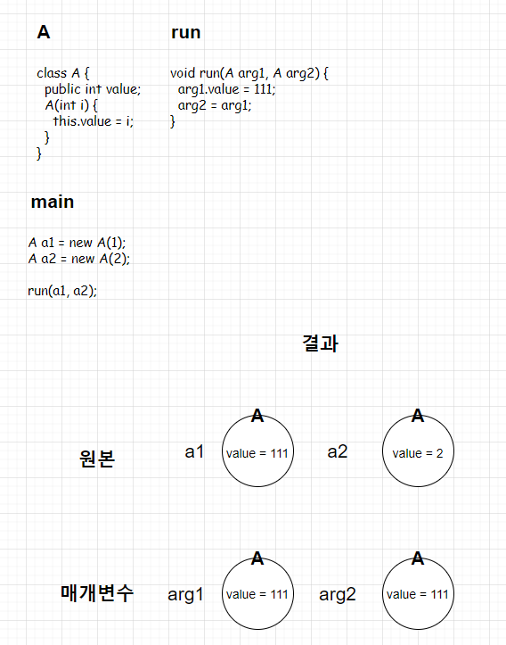
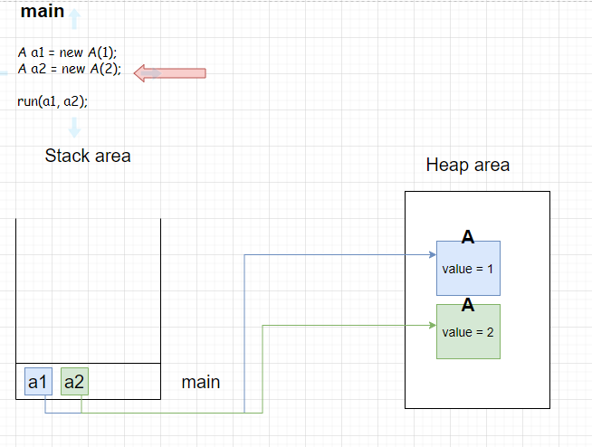
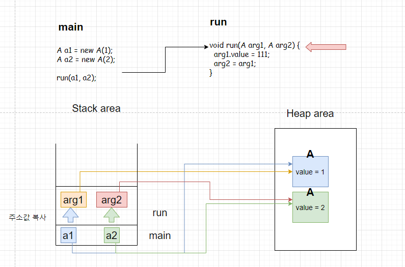
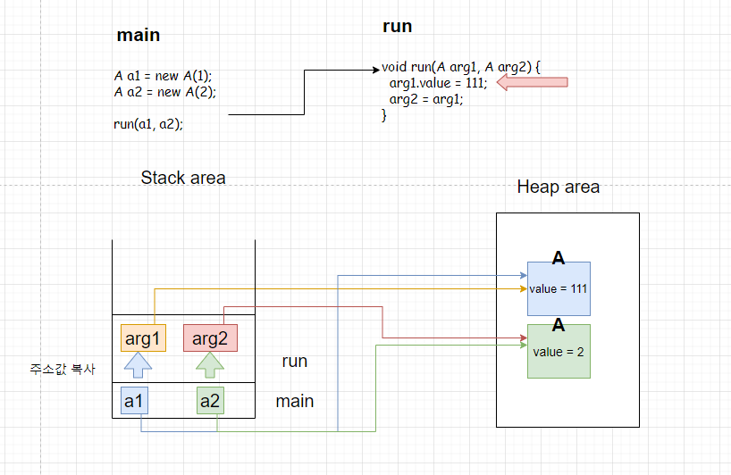

# 😃📢 Call by value VS Call by reference

## Call by value & Call by reference

<br>

Call by value : 
- 값을 호출하는 것을 의미
- 전달받은 값을 복사하여 처리
- 즉 전달받은 값을 변경하여도 원본은 불변

Call by reference : 
- 참조에 의한 호출을 의미
- 전달받은 값을 직접 참조
- 즉 전달받은 값을 변경할 경우 원본도 같이 변경

<br>

---

<br>

## 🙄 JAVA에는 Call by reference가 있을까?

- Java에서 객체를 전달받고, 그 객체를 수정하면 원본도 같이 수정되니 <br>
이것이 Call by reference라고 생각했다.

- 예를 들기 위한 클래스 A 
  - 클래스 A는 public 접근 지정자인 변수 value를 가지고 있고 이를 생성자의 매개변수로 지정

- A의 상태를 변경하는 메서드 run
  - 매개변수 A 클래스 arg1, arg2를 입력
  - arg1의 value를 111로 변경하고 arg2에 arg1을 저장

&nbsp;&nbsp;&nbsp;&nbsp;&nbsp;&nbsp;&nbsp;
&nbsp;&nbsp;&nbsp;&nbsp;&nbsp;&nbsp;&nbsp;
&nbsp;&nbsp;&nbsp;&nbsp;&nbsp;&nbsp;&nbsp;


- 여기서 주의깊게 봐야 하는 부분은 a1의 value가 111로 변경된 것
- arg1의 value를 변경하니 원본 a1의 값도 변경되었으니 이 것을 call by reference라고 헷갈리는 것
- 하지만 a1에서 arg1으로 매개변수를 넘기는 과정에서 직접적인 참조를 넘긴 게 아닌, 주소 값을 복사해서 넘기기 때문에 이는 call by value
- 복사된 주소 값으로 참조가 가능하니 주소 값이 가리키는 객체의 내용 변경되는 것

<br>

## 🔐 JVM 메모리 구조
<br>



- arg1은 a1이 가지고 있는 주소값을 복사하여 독자적으로 보유
- arg2도 마찬가지로 a2가 가지고 있는 주소 값을 복사하여 독자적으로 보유
- 주소 값을 복사하여 가져 가는 call by value가 발생
- arg1을 통해 value의 값을 변경한다면 arg1이 가지고 있는 주소 값을 통해 객체의 값을 변경

<br>



- arg2에 arg1의 값을 저장한다고 해도 이는 run 메서드 내에 존재하는 arg2가 arg1이 가진 주소값을 <br> 복사하여 저장하는 것일 뿐 원본 a2와는 독립된 변수이기 때문에 원본 a2는 불변

<br>



<br>

## Call By Reference

- C++에서는 메모리 주소를 개발자가 직접적으로 제어
- 즉 매개변수를 변경할 경우 원본도 같이 변경되는 Call by reference

```c++
#include<iostream>
using namespace std;

class A {
public:
	int value;
	A(int value) {
		this->value = value;
	}
};

void run(A* arg1, A* arg2) {
	arg1->value = 111;
	*arg2 = *arg1;
};


int main() {
	A* a1 = &A(1);
	A* a2 = &A(2);
	run(a1, a2);
	cout << "a1 : " << a1->value << ", a2 : " << a2->value;
	system("pause");
	return 0;
}
```

결과


- Java에서는 원본 데이터 a2가 변경되지 않았지만, C++에서는 Call by Reference를 통해 원본 a2가 변경된 것을 확인


<br>

