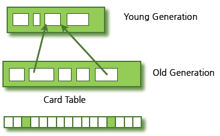
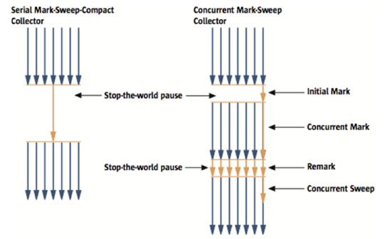

# 😃📢 Garbage Collection

<b>| stop-the-world </b>

	- GC을 실행하기 위해 JVM이 애플리케이션 실행을 멈추는 것
	- GC를 실행하는 쓰레드를 제외한 나머지 쓰레드는 모두 작업을 중단
	- GC 작업을 완료한 이후에야 중단했던 작업을 다시 시작
	- 어떤 GC 알고리즘을 사용하더라도 stop-the-world는 발생
	- 대개의 경우 GC 튜닝이란 이 stop-the-world 시간을 줄이는 것

<b> | Young & Old Genration </b>

	- Java에서는 개발자가 프로그램 코드로 메모리를 명시적으로 해제하지 않음
	- 대부분의 객체는 금방 접근 불가능 상태(unreachable)가 됨
	- 오래된 객체에서 젊은 객체로의 참조는 아주 적게 존재
	- 이러한 전제가 'weak generational hypothesis'
	- 이 전제의 장점을 최대한 살리기 위해서 HotSpot VM에서는 크게 2개로
	  물리적 공간을 나누었다. 둘로 나눈 공간이 Young 영역과 Old 영역

	| Young 영역(Yong Generation 영역)

	새롭게 생성한 객체의 대부분이 여기에 위치한다. 대부분의 객체가 금방 접근 불가능 상태가 되기 때문에 매우 많은 객체가 Young 영역에 생성되었다가 사라진다. 이 영역에서 객체가 사라질때 Minor GC가 발생한다고 말한다.

	| Old 영역(Old Generation 영역) 

	접근 불가능 상태로 되지 않아 Young 영역에서 살아남은 객체가 여기로 복사된다. 대부분 Young 영역보다 크게 할당하며, 크기가 큰 만큼 Young 영역보다 GC는 적게 발생한다. 이 영역에서 객체가 사라질 때 Major GC(혹은 Full GC)가 발생한다고 말한다.

 

<b> <h2> 영역별 데이터 흐름 </h2> </b>

 

 

[그림 1 GC 영역 및 데이터 흐름도]

 

위 그림의 Permanent Generation 영역(이하 Perm 영역)은 Method Area라고도 한다. 객체나 억류(intern)된 문자열 정보를 저장하는 곳이며, Old 영역에서 살아남은 객체가 영원히 남아 있는 곳은 절대 아니다. 이 영역에서 GC가 발생할 수도 있는데, 여기서 GC가 발생해도 Major GC의 횟수에 포함된다.

 

그렇다면 "Old 영역에 있는 객체가 Young 영역의 객체를 참조하는 경우가 있을 때에는 어떻게 처리될까?"라고 궁금해 하는 분도 더러 있을 것이다. 이러한 경우를 처리하기 위해서 Old 영역에는 512바이트의 덩어리(chunk)로 되어 있는 카드 테이블(card table)이 존재한다.

 

카드 테이블에는 Old 영역에 있는 객체가 Young 영역의 객체를 참조할 때마다 정보가 표시된다. Young 영역의 GC를 실행할 때에는 Old 영역에 있는 모든 객체의 참조를 확인하지 않고, 이 카드 테이블만 뒤져서 GC 대상인지 식별한다.

 

 

[그림 2 카드 테이블 구조]

 

카드 테이블은 write barrier를 사용하여 관리한다. write barrier는 Minor GC를 빠르게 할 수 있도록 하는 장치이다. write barrirer때문에 약간의 오버헤드는 발생하지만 전반적인 GC 시간은 줄어들게 된다.

 

<b> <h2> Young 영역의 구성 </h2> </b>  

GC를 이해하기 위해서 객체가 제일 먼저 생성되는 Young 영역부터 알아보자. Young 영역은 3개의 영역으로 나뉜다.

Eden 영역, Survivor 영역(2개). Survivor 영역이 2개이기 때문에 총 3개의 영역으로 나뉘는 것이다. 각 영역의 처리 절차를 순서에 따라서 기술하면 다음과 같다.

새로 생성한 대부분의 객체는 Eden 영역에 위치한다.
Eden 영역에서 GC가 한 번 발생한 후 살아남은 객체는 Survivor 영역 중 하나로 이동된다.
Eden 영역에서 GC가 발생하면 이미 살아남은 객체가 존재하는 Survivor 영역으로 객체가 계속 쌓인다.   

하나의 Survivor 영역이 가득 차게 되면 그 중에서 살아남은 객체를 다른 Survivor 영역으로 이동한다. 그리고 가득 찬 Survivor 영역은 아무 데이터도 없는 상태로 된다.
이 과정을 반복하다가 계속해서 살아남아 있는 객체는 Old 영역으로 이동하게 된다.   

이 절차를 확인해 보면 알겠지만 Survivor 영역 중 하나는 반드시 비어 있는 상태로 남아 있어야 한다. 만약 두 Survivor 영역에 모두 데이터가 존재하거나, 두 영역 모두 사용량이 0이라면 여러분의 시스템은 정상적인 상황이 아니라고 생각하면 된다.  

이렇게 Minor GC를 통해서 Old 영역까지 데이터가 쌓인 것을 간단히 나타내면 다음과 같다.

 

 

[그림 3 GC 전과 후의 비교]

 

참고로, HotSpot VM에서는 보다 빠른 메모리 할당을 위해서 두 가지 기술을 사용한다. 하나는 bump-the-pointer라는 기술이며, 다른 하나는 TLABs(Thread-Local Allocation Buffers)라는 기술이다.

 

bump-the-pointer는 Eden 영역에 할당된 마지막 객체를 추적한다. 마지막 객체는 Eden 영역의 맨 위(top)에 있다. 그리고 그 다음에 생성되는 객체가 있으면, 해당 객체의 크기가 Eden 영역에 넣기 적당한지만 확인한다. 만약 해당 객체의 크기가 적당하다고 판정되면 Eden 영역에 넣게 되고, 새로 생성된 객체가 맨 위에 있게 된다. 따라서, 새로운 객체를 생성할 때 마지막에 추가된 객체만 점검하면 되므로 매우 빠르게 메모리 할당이 이루어진다.

 

그러나 멀티 스레드 환경을 고려하면 이야기가 달라진다. Thread-Safe하기 위해서 만약 여러 스레드에서 사용하는 객체를 Eden 영역에 저장하려면 락(lock)이 발생할 수 밖에 없고, lock-contention 때문에 성능은 매우 떨어지게 될 것이다. HotSpot VM에서 이를 해결한 것이 TLABs이다.

 

각각의 스레드가 각각의 몫에 해당하는 Eden 영역의 작은 덩어리를 가질 수 있도록 하는 것이다. 각 쓰레드에는 자기가 갖고 있는 TLAB에만 접근할 수 있기 때문에, bump-the-pointer라는 기술을 사용하더라도 아무런 락이 없이 메모리 할당이 가능하다.

 

간단하게 Young 영역에 대한 GC에 대해서 알아보았다. 위에서 이야기한 두 가지 기술(bump-the-pointer, TLABs)을 반드시 기억하고 있을 필요는 없다. 몰라도 쇠고랑 안차고 경찰 출동 안한다. 그러나 Eden 영역에 최초로 객체가 만들어지고, Survivor 영역을 통해서 Old 영역으로 오래 살아남은 객체가 이동한다는 사실은 꼭 기억하기 바란다.

 

<b> <h2> Old 영역에 대한 GC </h2> </b>

Old 영역은 기본적으로 데이터가 가득 차면 GC를 실행한다. GC 방식에 따라서 처리 절차가 달라지므로, 어떤 GC 방식이 있는지 살펴보면 이해가 쉬울 것이다. GC 방식은 JDK 7을 기준으로 5가지 방식이 있다.

 

<b> 

- Serial GC
- Parallel GC
- Parallel Old GC(Parallel Compacting GC)
- Concurrent Mark & Sweep GC(이하 CMS)

</b> 

 

<b> | G1(Garbage First) GC </b> 

	이 중에서 운영 서버에서 절대 사용하면 안 되는 방식이 Serial GC다. Serial GC는 데스크톱의 CPU 코어가 하나만 있을 때 사용하기 위해서 만든 방식이다. Serial GC를 사용하면 애플리케이션의 성능이 많이 떨어진다.

<b> | Serial GC (-XX:+UseSerialGC) </b> 

	Young 영역에서의 GC는 앞 절에서 설명한 방식을 사용한다. Old 영역의 GC는 mark-sweep-compact이라는 알고리즘을 사용한다. 이 알고리즘의 첫 단계는 Old 영역에 살아 있는 객체를 식별(Mark)하는 것이다. 그 다음에는 힙(heap)의 앞 부분부터 확인하여 살아 있는 것만 남긴다(Sweep). 마지막 단계에서는 각 객체들이 연속되게 쌓이도록 힙의 가장 앞 부분부터 채워서 객체가 존재하는 부분과 객체가 없는 부분으로 나눈다(Compaction).
	
	Serial GC는 적은 메모리와 CPU 코어 개수가 적을 때 적합한 방식이다.

<b> | Parallel GC (-XX:+UseParallelGC) </b> 

	Parallel GC는 Serial GC와 기본적인 알고리즘은 같지다. 그러나 Serial GC는 GC를 처리하는 스레드가 하나인 것에 비해, Parallel GC는 GC를 처리하는 쓰레드가 여러 개이다. 그렇기 때문에 Serial GC보다 빠른게 객체를 처리할 수 있다. Parallel GC는 메모리가 충분하고 코어의 개수가 많을 때 유리하다. Parallel GC는 Throughput GC라고도 부른다.
	
다음 그림은 Serial GC와 Parallel GC의 스레드를 비교한 그림이다.

 

[그림 4 Serial GC와 Parallel GC의 차이]

 

<b> | Parallel Old GC(-XX:+UseParallelOldGC) </b> 

	Parallel Old GC는 JDK 5 update 6부터 제공한 GC 방식이다. 앞서 설명한 Parallel GC와 비교하여 Old 영역의 GC 알고리즘만 다르다. 이 방식은 Mark-Summary-Compaction 단계를 거친다. Summary 단계는 앞서 GC를 수행한 영역에 대해서 별도로 살아 있는 객체를 식별한다는 점에서 Mark-Sweep-Compaction 알고리즘의 Sweep 단계와 다르며, 약간 더 복잡한 단계를 거친다.

 

<b> | CMS GC (-XX:+UseConcMarkSweepGC) </b> 

	다음 그림은 Serial GC와 CMS GC의 절차를 비교한 그림이다. 그림에서 보듯이 CMS GC는 지금까지 설명한 GC 방식보다 더 복잡하다.

 

[그림 5 Serial GC와 CMS GC]

 

	초기 Initial Mark 단계에서는 클래스 로더에서 가장 가까운 객체 중 살아 있는 객체만 찾는 것으로 끝낸다. 따라서, 멈추는 시간은 매우 짧다. 그리고 Concurrent Mark 단계에서는 방금 살아있다고 확인한 객체에서 참조하고 있는 객체들을 따라가면서 확인한다. 이 단계의 특징은 다른 스레드가 실행 중인 상태에서 동시에 진행된다는 것이다.

	그 다음 Remark 단계에서는 Concurrent Mark 단계에서 새로 추가되거나 참조가 끊긴 객체를 확인한다. 마지막으로 Concurrent Sweep 단계에서는 쓰레기를 정리하는 작업을 실행한다. 이 작업도 다른 스레드가 실행되고 있는 상황에서 진행한다.

	이러한 단계로 진행되는 GC 방식이기 때문에 stop-the-world 시간이 매우 짧다. 모든 애플리케이션의 응답 속도가 매우 중요할 때 CMS GC를 사용하며, Low Latency GC라고도 부른다.

	그런데 CMS GC는 stop-the-world 시간이 짧다는 장점에 반해 다음과 같은 단점이 존재한다.

	다른 GC 방식보다 메모리와 CPU를 더 많이 사용한다.
	Compaction 단계가 기본적으로 제공되지 않는다.
	따라서, CMS GC를 사용할 때에는 신중히 검토한 후에 사용해야 한다. 그리고 조각난 메모리가 많아 Compaction 작업을 실행하면 다른 GC 방식의 stop-the-world 시간보다 stop-the-world 시간이 더 길기 때문에 Compaction 작업이 얼마나 자주, 오랫동안 수행되는지 확인해야 한다.

 

<b> | G1 GC </b> 

	마지막으로 G1(Garbage First) GC에 대해서 알아보자. G1 GC를 이해하려면 지금까지의 Young 영역과 Old 영역에 대해서는 잊는 것이 좋다.
	다음 그림에서 보다시피, G1 GC는 바둑판의 각 영역에 객체를 할당하고 GC를 실행한다. 그러다가, 해당 영역이 꽉 차면 다른 영역에서 객체를 할당하고 GC를 실행한다. 즉, 지금까지 설명한 Young의 세가지 영역에서 데이터가 Old 영역으로 이동하는 단계가 사라진 GC 방식이라고 이해하면 된다. G1 GC는 장기적으로 말도 많고 탈도 많은 CMS GC를 대체하기 위해서 만들어 졌다.

 

[그림 6 G1 GC의 레이아웃]

	G1 GC의 가장 큰 장점은 성능이다. 지금까지 설명한 어떤 GC 방식보다도 빠르다. 하지만, JDK 6에서는 G1 GC를 early access라고 부르며 그냥 시험삼아 사용할 수만 있도록 한다. 그리고 JDK 7에서 정식으로 G1 GC를 포함하여 제공한다.

	그러나 JDK 7을 실서비스에서 사용하려면 많은 검증 기간(1년은 필요하다는 생각이다)을 거쳐야 할 것으로 보이기 때문에, G1 GC를 당장 사용하고 싶어도 더 기다리는 것이 좋다는 것이 개인적인 생각이다. JDK 6에서 G1 GC를 적용했다가 JVM Crash가 발생했다는 말도 몇 번 들었기에 더더욱 안정화될 때까지 기다리는 것이 좋겠다.

 

