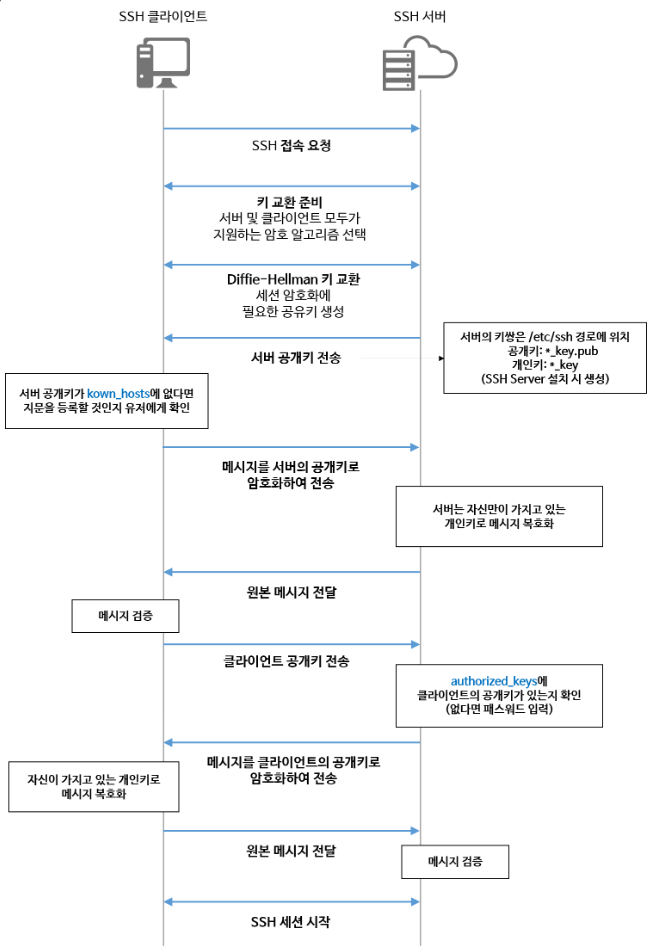

# 🔑SSH

## ✍🏻SSH란?
- Secure Shell Protocol
- 네트워크 프로토콜 중 하나로 인터넷과 같은 Public Network를 통해 통신할 때 보안적으로 안전하게 통신하기 위함
- 대표 사용 예
  - 데이터 전송
  - 원격 제어
  - Github - push
  - AWS 인스턴스 서버 접속, 제어
- 유사 프로토콜
  - FTP (File Transfer Protocol)
  - Telnet
- SSH Console
  - Putty
  - XShell
  - etc

---

 

## ✍🏻왜 SSH를 사용하는가?

- SSH는 인증부터 데이터 통신까지 높은 수준의 암호화를 지원함
- Telnet, FTP 프로토콜은 암호화를 제공하지 않음
- WireShark 같은 패킷 분석 툴을 사용하면 쉽게 통신 과정에서 옮겨지는 비밀번호나 파일 내용 등의 데이터 탈취 가능

 

## 🔐 SSH 작동 원리의 핵심

  - Key를 기반으로 통신
  - 클라이언트, 서버는 각각의 키를 보유
  - 키 생성 방식 두가지
    - 비대칭키(공개키, 개인키) : 접속 시도 시 클라이언트와 서버가 서로를 인증하기 위해 사용
    - 대칭키 : 접속이 허용된 상태에서 정보를 안전하게 주고 받기 위해 사용
  - SSH 접속 과정
     [1] 서버 인증 및 세션 키 생성
      - 접속하려는 서버가 올바른 서버인지 검증, 이후의 데이터 통신을 안전하게 진행하기 위한 세션 키를 생성
    1. 접속 요청을 받은 서버는 클라이언트에게 자신의 공개키를 전송
    2. 최초 접속이면 서버로부터 전달받은 공개키를 로컬에 저장할 건지 질의
    3. 동의하면 해당 공개키가 클라이언트 측 홈 디렉토리의 .ssh/know_hosts 파일 내에 추가
    4. 이후부터는 해당 서버에 접속 요청을 할 떄 마다 서버로부터 전달받은 공개키가 로컬에 저장되어 있는 공개키와 같은 것인지 검증
    5. 이 과정에서 데이터 통신 시 암호화 및 복호화를 위해 사용될 대칭키(세션키) 생성

     [2]클라이언트 인증
    - 클라이언트가 해당 서버에 대해 올바른 접근 권한을 가지고 있는지 검증
    - Password 인증
      - 보안 상 취약함. 권장하지 않음
    - SSH 공개키 인증
      - 권장되는 인증 방식. 인증 절차는 하기와 같음
      - 클라이언트 측에서 Key Pair를 생성하고 서버에 공개키를 전송하는 작업은 이미 완료된 상태로 가정
    1. 클라이언트는 해당 서버에 접속하기 위해 사용할 Key Pair의 ID를 서버에 전송
    2. 서버는 해당 ID에 매칭되는 공개키를 홈 디렉토리의 .ssh/authorized_keys 파일에서 검색
    3. 존재한다면, 난수 값을 생성. 해당하는 공개키로 암호화하여 클라이언트에 전송
    4. 클라이언트는 암호화된 난수 값을 전달받고  개인키로 복호화한다.
    5. 이후 복호화한 난수 값을 이용하여 MD5 해시 값을 계산하고, 이를 다시 서버에 전송
    6. 서버도 생성했던 난수 값을 이용하여 MD5 해시 값을 계산, 클라이언트로부터 받은 값과 같은지 검사.
    7. 같다면, 올바른 클라이언트임이 인증되어 본격적인 데이터 통신이 가능해진다.

 
[대칭키 & 비대칭키 란?]()
 

- SSH 데이터 통신 과정
  - 접속 시 생성한 대칭키 (세션키) 를 이용하여 서로 데이터를 주고 받으며 통신
  - 보낼 때, 받을 때 대칭키로 암호화, 복호화하는 방식
  - 통신이 종료되면 (SSH 세션이 종료) 대칭키는 폐기되며, 다시 접속할 때마다 새로운 대칭키가 생성되어 통신에 사용된다.

   

## 📈 SSH 인증 및 통신 과정

 

&nbsp;&nbsp;&nbsp;&nbsp;&nbsp;&nbsp;&nbsp;&nbsp;
&nbsp;&nbsp;&nbsp;&nbsp;&nbsp;&nbsp;&nbsp;&nbsp;
&nbsp;&nbsp;&nbsp;&nbsp;&nbsp;&nbsp;&nbsp;&nbsp; 

