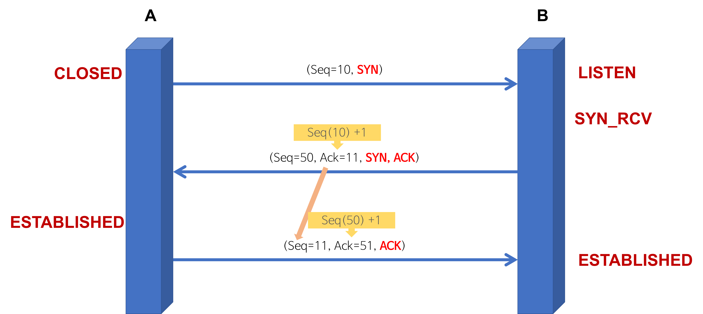
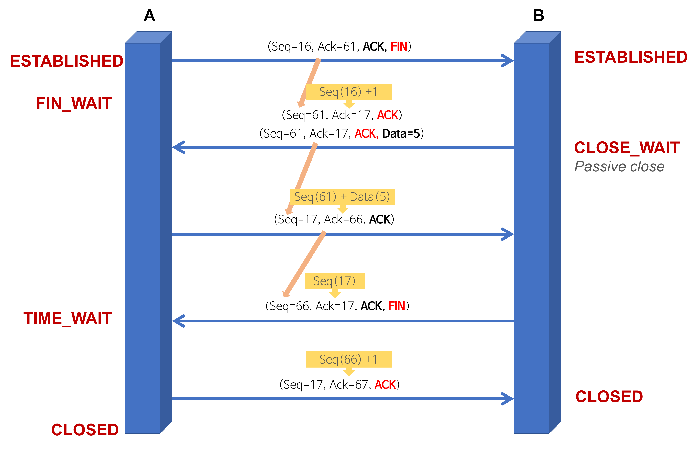

# 🤝🏻TCP 3-Way Handshaking

## 3-Way Handshaking

- TCP는 장치들 사이에 논리적인 접속을 성립(establish)하기 위하여 three-way handshake를 사용
- TCP/IP를 이용하는 응용프로그램이 정확한 데이터 전송 보장을 위해 상대방 컴퓨터와 사전에 세션을 수립하는 과정
- TCP 접속을 성공적으로 성립하기 위하여 반드시 필요
- Client > Server : TCP SYNServer > Client : TCP SYN ACKClient > Server : TCP ACK
- SYN : 'synchronize sequence numbers'
- ACK : 'acknowledgment'
- TCP의 3-way Handshaking 역할
  - 양쪽 모두 데이타를 전송할 준비가 되었다는 것을 보장
  - 실제로 데이타 전달이 시작하기전에 한쪽이 다른 쪽이 준비되었다는 것을 알림
  - 양쪽 모두 상대편에 대한 초기 순차일련변호를 획득

 

 

- TCP의 3-way Handshaking 과정
  - [STEP 1] A클라이언트는 B서버에 접속을 요청하는 SYN 패킷을 보낸다.  
  이때 A클라이언트는 SYN 을 보내고 SYN/ACK 응답을 기다리는SYN_SENT 상태가 되는 것이다.
  - [STEP 2] B서버는 SYN요청을 받고 A클라이언트에게 요청을 수락한다는 ACK 와 SYN flag 가  
  설정된 패킷을 발송하고 A가 다시 ACK으로 응답하기를 기다린다. 이때 B서버는 SYN_RECEIVED 상태가 된다.
  - [STEP 3] A클라이언트는 B서버에게 ACK을 보내고 이후로부터는 연결이 이루어지고 데이터가 오가게 되는것이다.   
  이때의 B서버 상태가 ESTABLISHED 이다.위와 같은 방식으로 통신하는것이 신뢰성 있는 연결을 맺어 준다는  
  TCP의 3 Way handshake 방식이다.

 

---

 

## 4-Way Handshaking

- 4-Way handshake는 세션을 종료하기 위해 수행되는 절차

 

 

- TCP의 4-way Handshaking 과정
  - [STEP 1] 클라이언트가 연결을 종료하겠다는 FIN플래그를 전송
  - [STEP 2] 서버는 일단 확인메시지를 보내고 자신의 통신이 끝날때까지 기다리는데   
  이 상태가 TIME_WAIT 상태
  - [STEP 3] 서버가 통신이 끝났으면 연결이 종료되었다고 클라이언트에게 FIN플래그를 전송
  - [STEP 4] 클라이언트는 확인했다는 메시지를 보낸다.

   

  - 만약 "Server에서 FIN을 전송하기 전에 전송한 패킷이 Routing 지연이나 패킷 유실로 인한  
  재전송 등으로 인해 FIN패킷보다 늦게 도착하는 상황"이 발생한다면 어떻게 될까?
    - Client에서 세션을 종료시킨 후 뒤늦게 도착하는 패킷이 있다면 이 패킷은 Drop되고 데이터는 유실
    - 이러한 현상에 대비하여 Client는 Server로부터 FIN을 수신하더라도 일정시간(디폴트 240초) 동안 세션을 남겨놓고 잉여 패킷을 기다리는 과정을 거치게 되는데 이 과정이 "TIME_WAIT"

 

----

 

