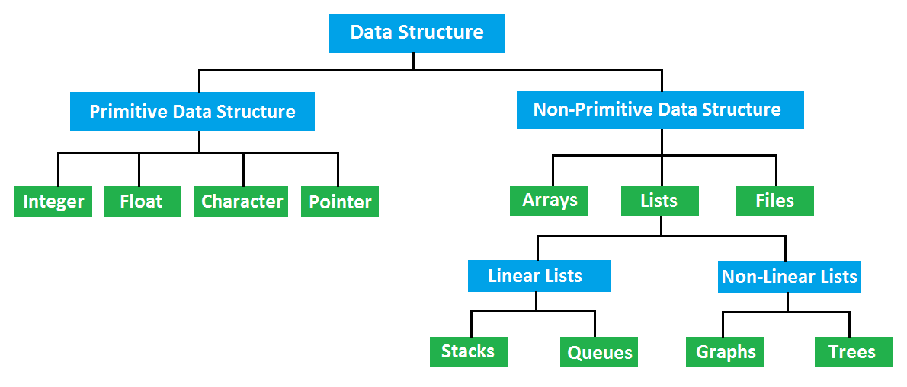

# Algorithm
## Data Structure
> 데이터 값의 모임, 각 원소들이 논리적으로 정의된 규칙에 의해 나열되며 자료에 대한 처리를 효율적으로 수행할 수 있도록 자료를 구분하여 표현한 것.
  

 ### 리스트
   - 순서가 존재하며, 일렬로 나열된 값이 있음
   - 리스트가 담는 자료에 적용되는 연산
      : 조회, 삽입, 삭제 등

 ### Array (배열)
   > 리스트라는 추상적 자료형을 구현한 대표적인 예시가 바로 `배열`
   - 동일한 타입의 데이터들 저장, 고정된 크기
   - 인덱싱이 되어 있어 인덱스 번호로 데이터에 접근
   - 배열 목록, 힙, 해시 테이블, 벡터 및 행렬과 같은 기타 데이터 구조를 구축하기 위한 빌딩 블록으로 사용
   - 삽입 정렬, 빠른 정렬, 버블 정렬 및 병합 정렬과 같은 다양한 정렬 알고리즘에 사용

   

  

