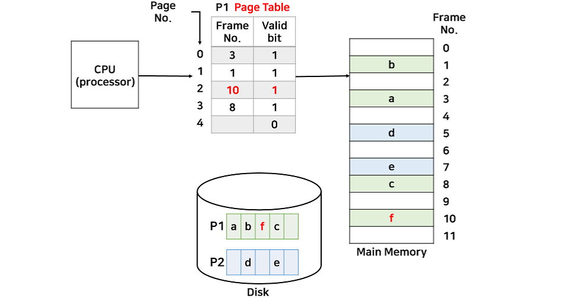

# 가상 메모리
 - 실제 이용 가능한 메모리 자원을 추상화하여 사용자에게 매우 큰 메모리로 보이게 만드는 것을 말한다. 
 - 멀티 프로세싱 환경에서 많은 프로세스 때문에 메모리 사용이 증가
 - 가끔 사용되는 자원을 메모리에 모두 올리는 것은 비효율 
 - 가상메모리를 활용하여 일부만 실제 메모리에 올리도록 함
 - 프로세스가 죽을 시 자원회수가 용이함
 - 가상 메모리는 Demand paging 방식과 Demand segmentation 방식이 있다.
 - 가상주소는 MMU에 의해 실제 주소 변환 페이지 테이블 로 관리, TLB를 통해 속도 향상

## 가상메모리의 장점
- 실제 메모리 크기에 제약받지 않음.
- 파일,라이브러리 공유 및 프로세스 생성 시에도 유용하게 사용됨.
- 응답 시간 유지, CPU 이용률, 처리율 상승
- 동시에 많은 프로그램을 실행 시킬 수 있게 되고, 이에따라 위와 같은 장점이 나타남.
- SWAP에 필요한 입출력이 줄어들어 실행이 빨라짐(context switch, kernel 개입 최소화)

## Demand Paging (요구 페이징)
- 메모리 관리 메커니즘(MMU 메커니즘)을 사용해서 여러 프로세스가 시스템의 메모리를 효율적으로 공유할 수 있도록 하는 기법
- 프로그램 전체가 아니라, CPU의 요청이 들어오면 필요한 부분만 메모리에 적재하고, 페이지들이 실행 과정에서 실제로 필요할 때 해당 부분을 메모리로 적재한다.
- 사용하지 않을 페이지를 가져오는 시간과 메모리 낭비를 줄일 수 있다.
- Page table을 사용하여 가상 메모리를 관리한다.
- 운영체제가 page fault를 해결하기 위한 과정으로 사용한다.

P1이 수행 중일 때의 페이지 테이블 
기존의 페이지 테이블과 다른 점은 valid bit 가 추가
 valid bit 는 현재 메모리에 페이지가 있는지 없는지를 나타내는 비트
현재 페이지가 메모리에 있다면 1, 없다면 0값을 갖는다.

CPU에서 P1의 3번째 페이지에 접근할 때 valid bit값이 0이라면 CPU에 인터럽트 신호를 발생
운영체제 내부의 ISR로 디스크 내부의 프로세스 P1에 있는 2번째 페이지를 메모리에 할당하는 작업을 처리한다.

### TLB 
메모리와  cpu 사이 에 있는 주소 변환을 위한 캐시  

### 스와핑 
 페이지 폴트를 방지하기 위해 당장 사용하지 않은 영역을 하드로 옮겨 필요할 때 램으로 불러와 올리고 사용하지 않을 시 다시 하드로 내림을 반복하는 램을 효과적으로 관리하는 용어

### Thrashing 
가상 메모리를 사용함으로써 발생할 문제점 중 하나
너무 많은 프로세스 -> 스와핑 증가 -> 페이지 폴트 자주 발생 -> CPU 이용률 낮아짐 -> OS가 가용률를 더 높이기 위해 더 많은 프로세스를 메모리에 올림 -> 악순환 반복

#### 해결 방법
- 작업세트 과거 사용 이력을 통해 페이지 집합을 만들어 미리 메모리에 로드 탐색, 스와핑을 줄임
- PFF 페이지 폴트 빈도 조절

## 페이지 폴트(Page fault) 

### 프로세스 의 주소 공간에 존재하지만 지금 컴퓨터의 램에 없는 데이터에 접근시 발생한다. OS는 다음 과정으로 해당 데이터를 메모리로 가져와 페이지 폴트가 발생하지 않는 것처럼 동작함
1. cpu는 물리 메모리를 확인하여 페이지가 없으면 트랩 발생 운영체제에 알림
2. OS는 cpu의 동작을 멈춤
3. OS는 페이지 테이블 확인 가상 메모리의 존재 확인 -> 없으면 프로세스 중단 현재 물리 메모리에 비어 있는 프레임이 있는 찾는다. 물리 메모리가 없다면 스와핑 발동
4. 비어있는 프레임에 해당하는 페이지 로드 , 페이지 테이블 최신화
5. 중단된 cpu 작동
- 페이지 -> 가상메모리 최소 크기 단위 
- 프레임 -> 실제 메모리 최소 크기 단위

1. 가상 메모리가 필요한 이유를 설명해주세요.

2. 요구 페이징이란 무엇인가요?

3. Page Fault가 발생 시, Page 교체 순서를 설명해주세요.