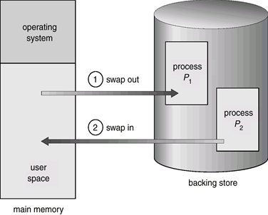

# 메모리 할당

## 연속할당
### 고정 불할 방식
- 메모리를 미리 나누어 관리
- 내부 단편화가 발생
### 가변 분할 방식
- 크게에 맞게 동적으로 메모리를 나눔
- 내부 단편화 발생 X, 외부 단편화 발생 
- 종류 : 최초적합, 최적적합, 최악적합

### 단편화
메모리에 프로세스들이 적재, 제거되는 일이 반복된다.
이때, 프로세스들이 차지하는 메모리 틈 사이에 프로세스가 충분히 사용하지 못하는 작은 공간들이 늘어난다. <- 이 작은 공간을 '단편화'라고 한다.
실제로는 메모리 공간이 충분하지만, 사용이 불가능하여 시스템 성능이 저하될 수 있다.
페이지 교체가 자주 일어난다.
#### 외부 단편화
프로세스의 크기 > 단편화 크기인 경우, 해당 공간이 비었음에도 불구하고 프로세스가 공간을 차지(적재)하지 못하여 놀게 되는 메모리 공간을 의미한다.
어떤 프로세스도 차지하지 못한 빈 공간이지만, 사용할 수 없다.
ex) 동적 메모리 할당 해제를 자주하는 경우
#### 내부 단편화
프로세스의 크기 < 단편화 크기인 경우, 해당 공간에 프로세스를 적재한 후 남게 되는 메모리 공간을 의미한다.
프로세스가 차지한 공간 내부에서 발생하는 사용하지 않는 작은 공간이다.
ex) 배열을 크게 잡은 경우, Paging 기법에서 page 크기를 크게 잡을 경우

#### 외부 단편화 
- 나눈 크기보다 프로그램이 커서 들어가지 못해 발생하는 현상 

- 외부 단편화 해결방법
1. 메모리 압축
2. 페이징 기법 & 세그멘테이션 기법

## 불연속할당
### 페이징
### 세그멘테이션
### PAGED SEGMENTATION
### 압축
- 외부 단편화를 해결하기 위해 프로세스가 사용하는 공간들을 한쪽으로 몰아, 하나의 큰 가용 공간을 확보
- 효율적이진 않은 행동

## Swapping

메모리를 관리하기 위해 사용되는 기법
메모리에 올라온 프로세스의 주소 공간 전체를 디스크의 swap area(backing store)에 일시적으로 내려놓는 것
프로세스가 실행되기 위해서는 메모리에 있어야 하지만, 프로세스는 실행 중에 임시로 예비저장장치(backing store)에 내보내어졌다가 실행을 계속하기 위해 다시 메모리로 돌아올 수 있다.
프로세스가 종료되어 그 주소 공간을 디스크로 내보내는 것이 아니다.
CPU 할당 시간이 끝난 프로세스(ready, waiting상태)를 디스크로 내보내고 다른 프로세스를 메모리에 올린다. swapping
1. 많은 프로세스가 동시에 메모리에 올라오면, 프로세스당 할당되는 메모리의 양이 줄어들기 때문에 시스템 전체 성능에 영향을 미친다.
2. 이런 문제를 해결하기 위해, swapping을 통해 몇몇 프로세스의 주소 공간 전체를 디스크의 swap area에 보냄으로써(swap out) 적절한 메모리 공간을 유지한다.
3. 이후에 메모리에 있는 프로세스가 충분히 실행되고 나면, 해당 프로세스를 내보낸다.
4. 그리고 그 자리에 swap out 되었던 프로세스를 다시 메모리에 올린다. (swap in)
즉, Swapping은 메모리에 존재하는 프로세스의 수를 조절하는 중요한 역할을 한다.
1) swap area(backing store)
디스크 내에 파일 시스템과는 별도로 존재하는 일정 영역
프로세스가 실행중인 동안만 디스크에 일시적으로 저장하는 공간
저장기간이 상대적으로 짧다.
다수의 프로세스를 담을 수 있을 만큼 충분히 큰 공간이어야 한다.
어느 정도의 접근 속도가 보장되어야 한다.

## 페이지 교체 알고리즘 
### 오프라인, FIFO, LRU

1. 운영체제의 메모리 관리 전략인 연속 할당, 동적 할당의 차이점을 설명해주세요.

2. Swapping이란 무엇이며, Swapping시 발생할 수 있는 문제점을 설명해주세요.

3. 페이징과 세그먼테이션에 대해서 설명하세요.

4. 내부 단편화와 외부 단편화가 무엇인지 설명하세요.

5. 외부 단편화를 해소할 수 있는 방법을 두 가지 이상 설명해주세요.

