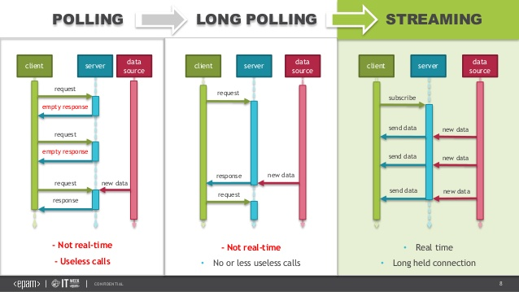
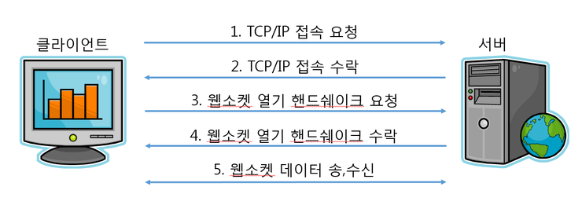
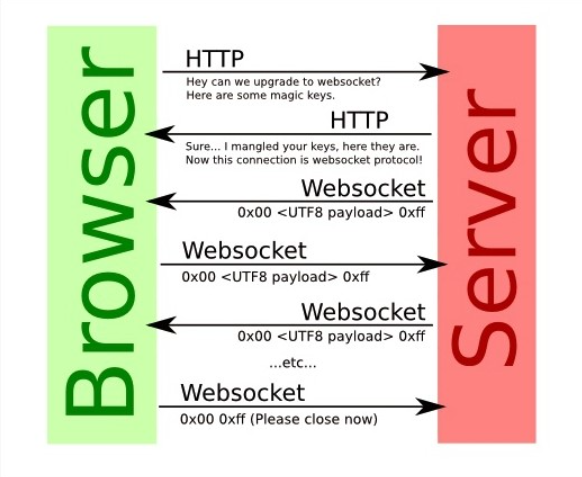
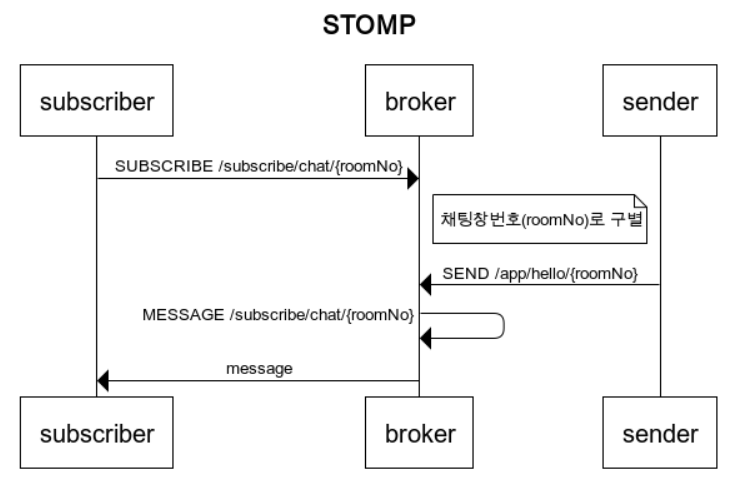

# WebSocket

- 주요 활용처 알람, 실시간 댓글, 주식차트

- 기존의 단방향 HTTP 프로토콜과 호환, 양방향 통신을 제공하기 위해 개발된 프로토콜
- 일반 Socket통신과 달리 HTTP 80 Port를 사용하므로 방화벽에 제약이 없으며 통상 WebSocket으로 불린다
- 접속까지는 HTTP 프로토콜 그 이후 그 이후 통신은 자체적인 WebSocket 프로토콜로 통신

## 사실 HTTP만으로도 원하는 정보를 송수신할 수 있었지만, 인간의 욕심은 끝이 없기에 인터넷이 발전함에 따라 원하는 것이 더욱 다양해졌다. 예를 들어 클라이언트가 먼저 요청하지 않아도 서버가 먼저 데이터를 보내거나, 표준 TCP/IP 통신을 사용해 특정 서버와 통신을 하는 등 원하는 것이 늘어가자 그것을 이루고자 많은 플러그인 및 웹 기술이 개발되었다.

## WebSocket이 존재하기 전
- Polling
- Long Polling
- Streaming등의 방식으로 해결

### Polling
- 서버에 계속 요청으로 이벤트 내용을 전달
- 가장 쉬운 구현 하지만 클라이언트의 수가 많아지면 서버의 부담이 급증
- HTTP Request Connection을 맺고 끊는 것 자체가 부담이 많은 방식
- 클라이언트에서 실시간 정도의 빠른 응답을 기대하기 어렵다.

### Long polling
- 클라이언트에서 서버로 일단 HTTP Request를 요청
- 대기 후 서버에서 클라이언트에 보낼 메세지가 생기면 보낸 후 연결 종료
- polling보다 서버의 부담이 줄음
- 이벤트 시간이 좁다면 polling과 차이 없음
- 다수의 클라이언트에게 동시에 이벤트가 발생될 경우 서버의 부담이 급증

### Streaming 
- Long Polling과 마찬가지로 클라이언트 -> 서버로 HTTP Request를 요청한다.
- 서버 -> 클라이언트로 이벤트를 전달할 때 해당 요청을 해제하지 않고 필요한 메세지만 보내기(Flush)를 반복하는 방식. 
- Long Polling과 비교하여 서버에 메세지를 보내지 않고도 다시 HTTP Request 연결을 하지 않아도 되어 부담 경감

### Websocket

- 2014년 HTML5에 웹 소켓을 포함
- 웹소켓은 클라이언트가 접속 요청을 하고 웹 서버가 응답한 후 연결을 끊는 것이 아닌 Connection을 그대로 유지하고 클라이언트의 요청 없이도 데이터를 전송할 수 있는 프로토콜

## Websocket vs Sockjs vs Stompjs
